## ВОПРОС 1 : В каком terraform-файле, согласно этому .gitignore, допустимо сохранить личную, секретную информацию?
ОТВЕТ:
В файле gitignore указана строчка: 

-- # own secret vars store. 
personal.auto.tfvars --

Она и указывает, что личные переменные можно хранить в файле personal.auto.tfvars, они не попадут на GIT при операции pull
------

## ВОПРОС 2 : Найдите в state-файле секретное содержимое созданного ресурса random_password, пришлите в качестве ответа конкретный ключ и его значение
ОТВЕТ: "result": "9VtxI3SF7LBq0jEw"

------

## ВОПРОС 3 : Найти ошибки, обяснить их и исправить

При выполнении кода получаем ошибки:

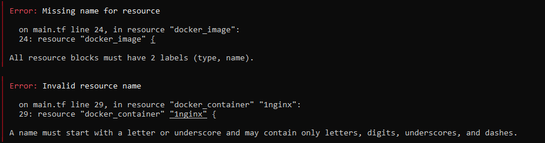

Первая ошибка указывает на то, что нашему ресурсу не задано имя в блоке label: 
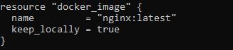

Вторая ошибка указывает на неверное имя ресурса, оно не должно начинаться с цифры:
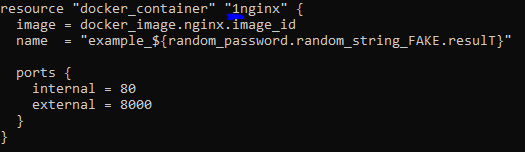

После исправления данных ошибок мы получим ещё одну:
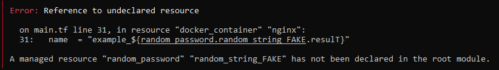
Она указывает на то, что terraform не может найти в root module ресурс "random_password" с лейблом "random_string_FAKE", т.к. у насв коде указать просто "random_string", а также можно заметить опечатку в .result. 

Исправленный код будет иметь следующий вид:
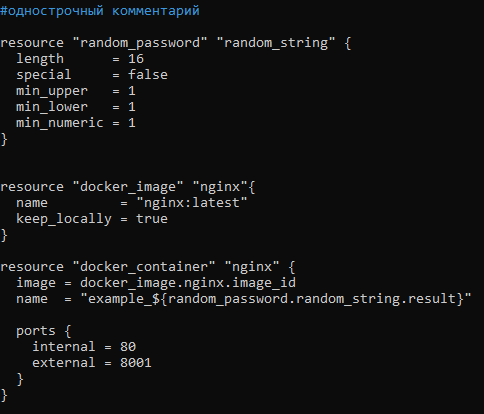

Данный код уже успешно проходит валидацию.

(один момент: я исправил код для запуска на порту 8001, т.к. на моей машине на порту 8000 я использую portainer.)
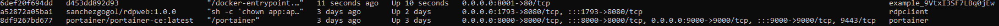

------

## ВОПРОС 4 : Выполните команду terraform apply -auto-approve. В чем её опасность и чем она полезна?
Изменяем имя контейнера:
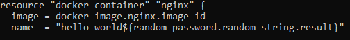

Использованию флага -auto-approve приведет к автоматическому применению изменений, внесённых в файл .tf. Это небезопасно, т.к. внесенные изменения могут привести к неожиданным для пользователя последствиям как в лучшую, так и худшую сторону(к примеру будет удален жизенно важный контейнер с множеством данных). Если код был тщательно протестирован, то применение данного ключа позволит быстро проводить развертывание инфраструктуры без взаимодействия с пользователем

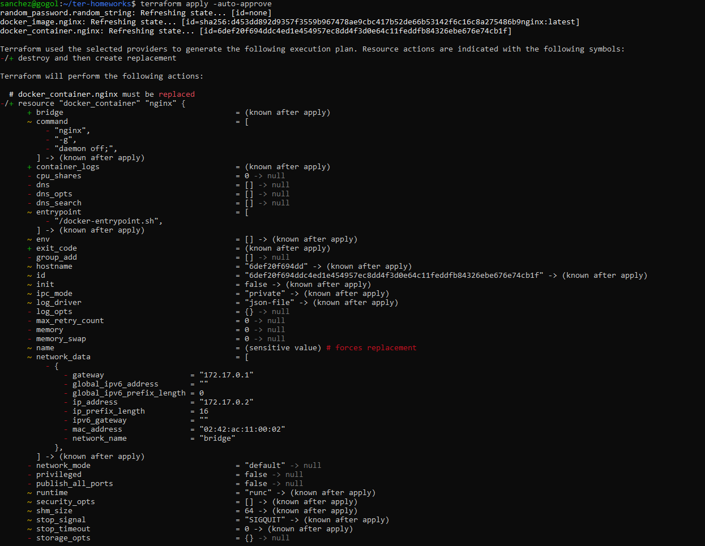
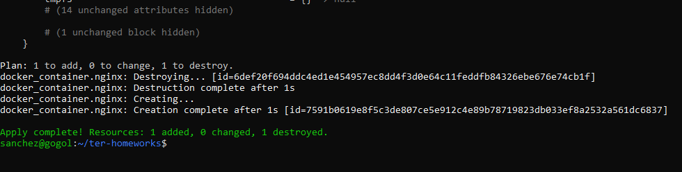
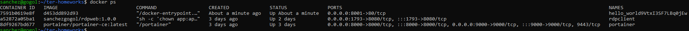

------

## ВОПРОС 5 : Уничтожьет созданные ресурсы с помощью teraform.

Используем terraform destroy:

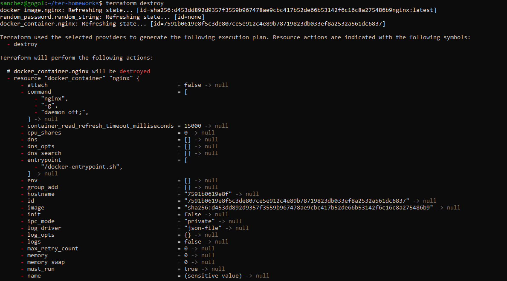
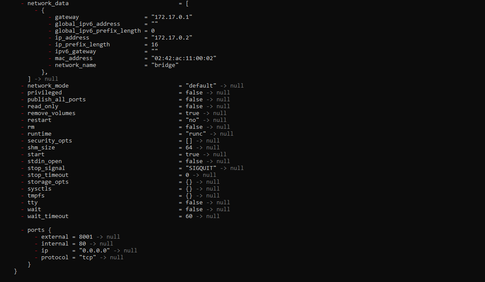
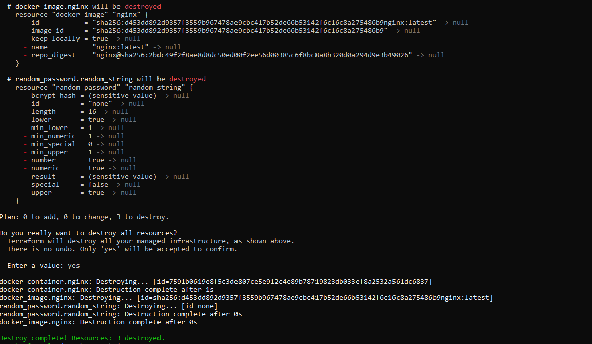

Содержимое tfstate:
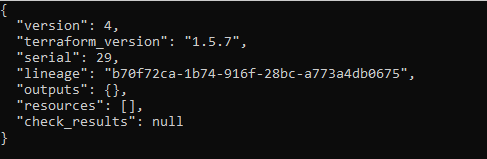

docker ps
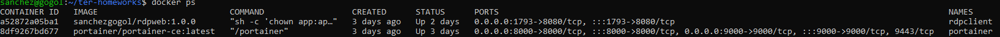

------
## Почему не удалился образ nginx?
При запуске образа задействован аргумент keep_locally, который отвечает за сохранность образа после операции destroy:
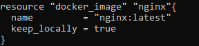

Об этом аргументе говорит документация провайдера docker в среде Resource (docker_image) 

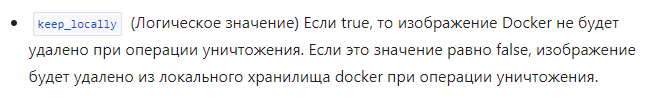
