##Задание 1 пункт 4: Инициализируйте проект, выполните код. Исправьте намеренно допущенные синтаксические ошибки. Ищите внимательно, посимвольно. Ответьте, в чём заключается их суть.
При попытке запуска проекта мы сталкиваемся с проблемой:
- 

Тут суть в том, что нами небыли записаны значения в переменные, по этому терраформ просит ввести значения этих переменных из консоли.
Для исправления нужно указать какие значения нам нужно использовать:

- 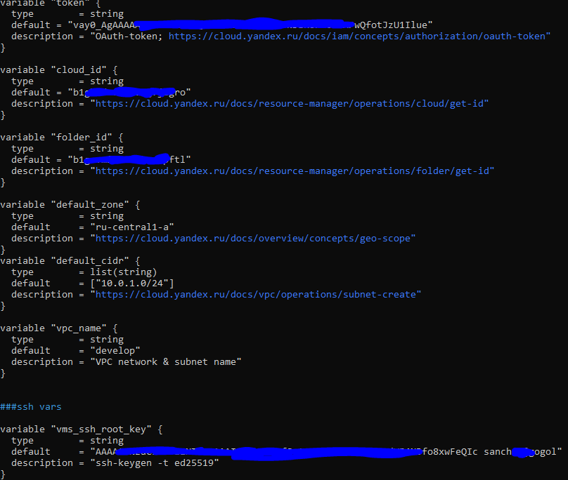

После попытки применить terraform apply, Сталкиваемся с ошибкой допустимого количества ядер в указанной платформе. Перед этим, была ошибка о том, что id платформы небыло найдено. Как оказалось, в описании было id standart-v4, оно было изменено мной на standard-v2,  но ситуацию это не решило. Изменение platform_id на "standard-v1", как указано в документации это дефолтное значение, дало возможность проекту запуститься.

- 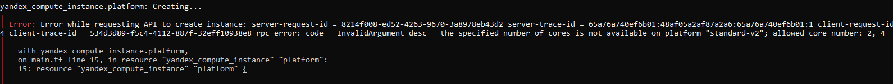

 применяем terraform apply 

- 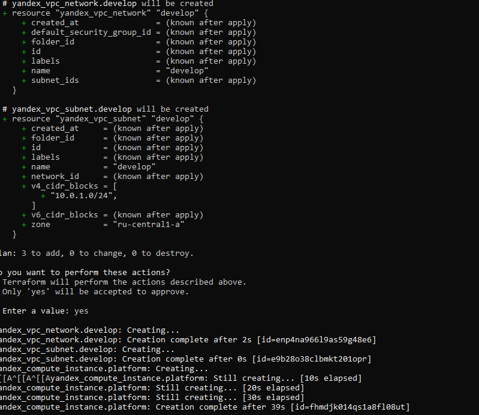

По итогу вм запускается и можно выполнить curl ifconfig.me

- 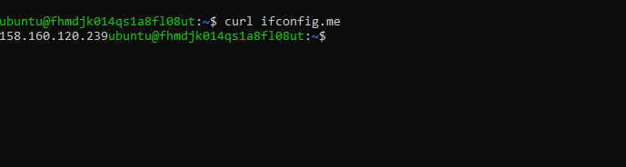

Для выполнения следующих заданий кладём прод:

- 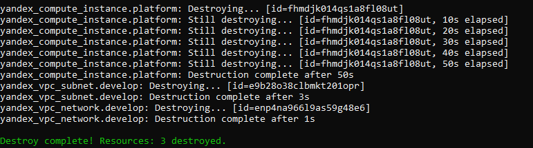

------

## Задание 3: vms_platform.tf и netology-develop-platform-db

Я создал файл vms_platform.tf и перенёс туда переменные, касающиеся параметров ВМ. Т.к. далее потребуется создать ещё одну машину, сразу задаю ей дополнительные переменные. По условиям, вторая вм должна работать в другой зоне, по этому я ещё добавил дополнительную подсеть, т.к. машина должна работать в той же зоне, в какой и находится подсеть (параметры зоны выставил в файле variables):
### vms_platform.tf
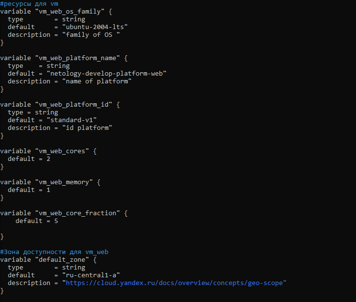
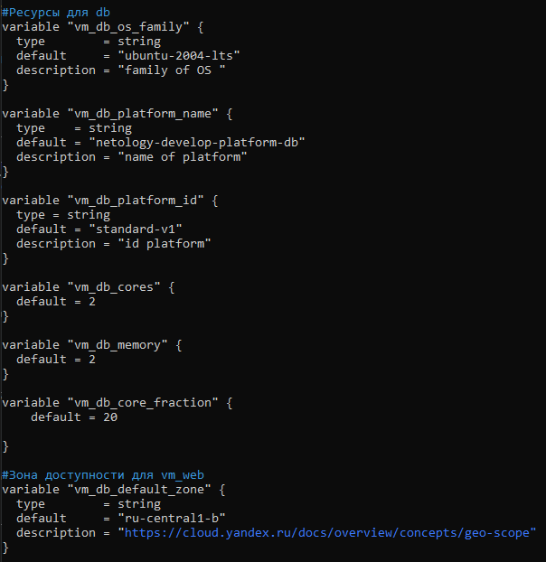

### variables.tf

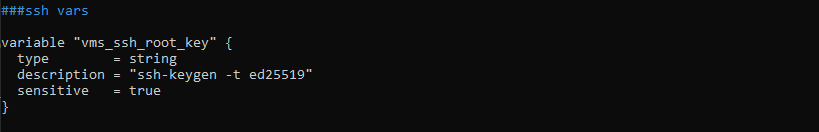

### main.tf

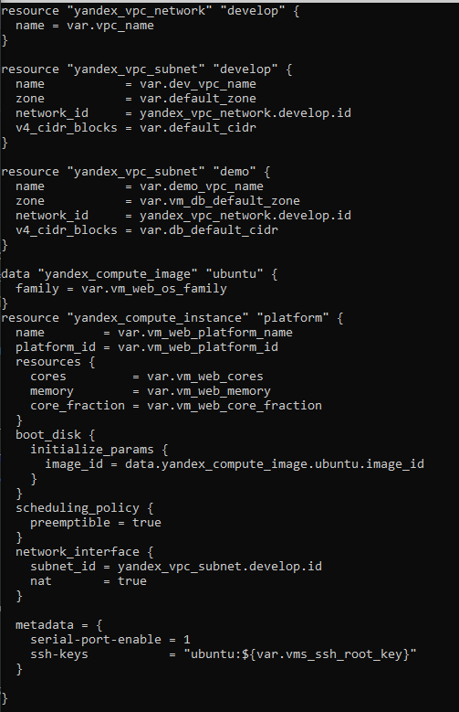
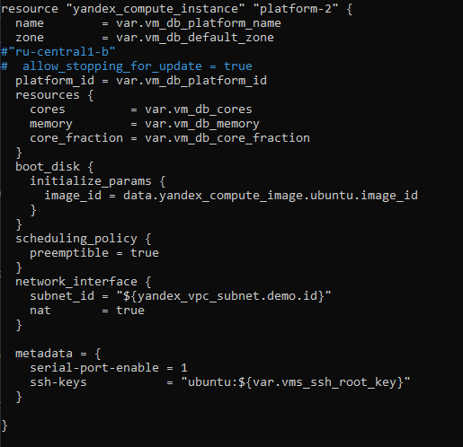

### Итоги в яндексе
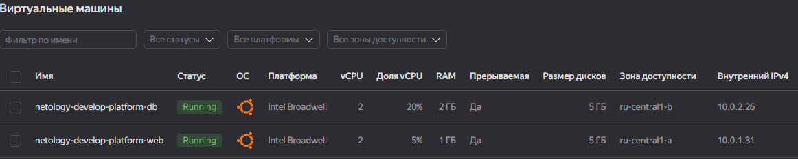
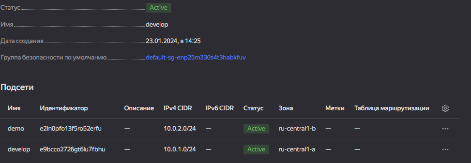

------

## Задание 4: Файл output
Прописываем файл putputs:

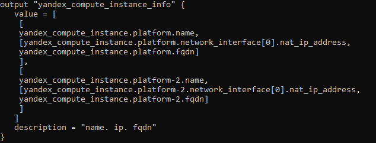

В нём я в вывод подаю список из двух списков, в каждом из которых спрятано имя машины и список с её конфигурациями.

Вывод:

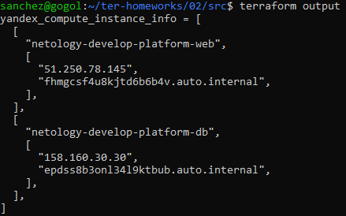

-----

## Задание 5: locals

Для выполнения этого задания я создал дополнительные переменные:

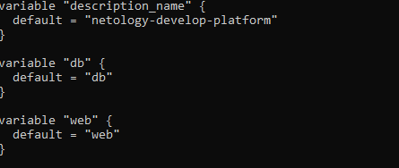

В locals описал метод создания имени машины:

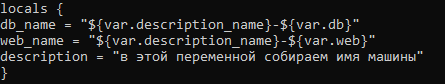

правим main.tf для того, чтобы использовались locals

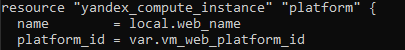

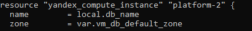

Применяем изменения:

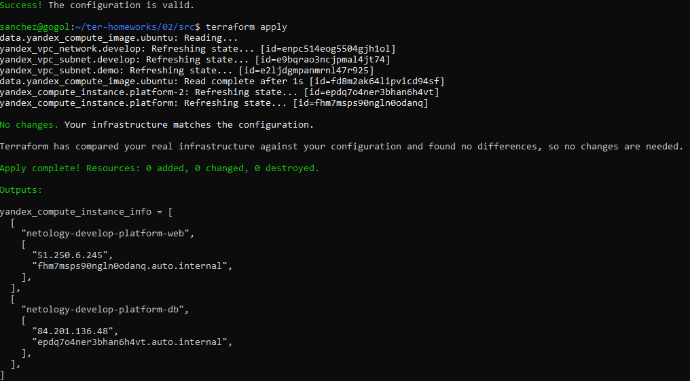

Видим, что изменения были приняты и новое имя машины не отличается от старого, по этому tf не вносил изменения.

####map

Теперь необходимо создать map переменную для metadata. Т.К. terraform не позволяет использовать переменные внутри других переменных, я использую locals для создания map переменной с переменной в строке ssh ключа:

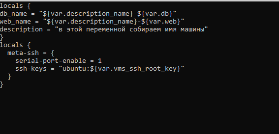

Помещаю данную переменную в блоки metadata:

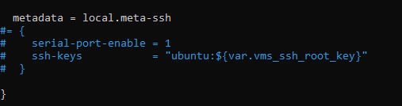

эту процедуру я провел с конфигами обеих ВМ.

Теперь закомментирую все ненужные переменные:

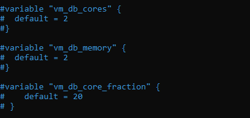
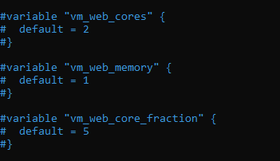

Terraform plan:
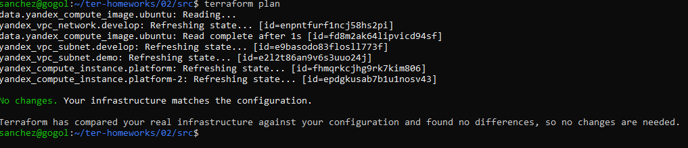
